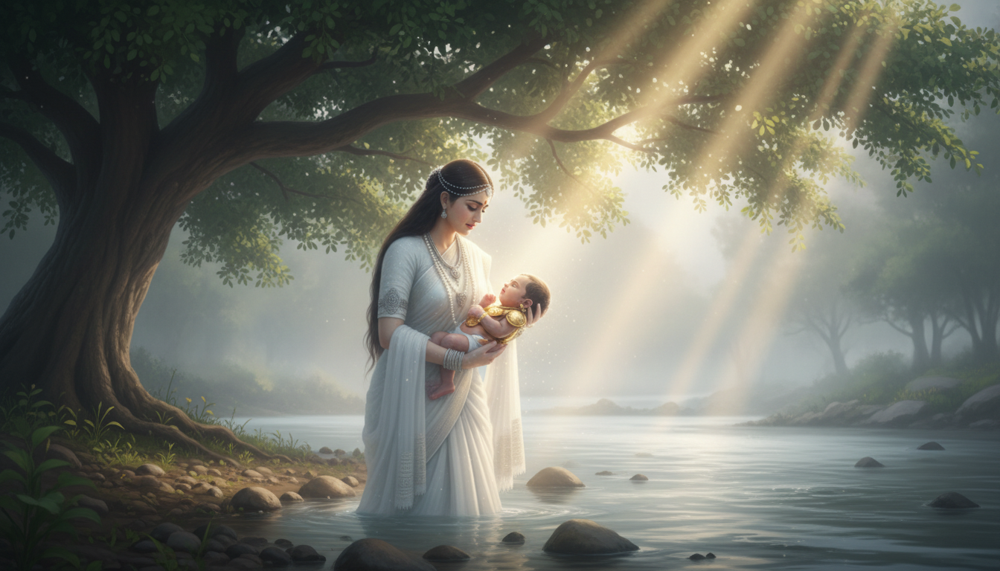
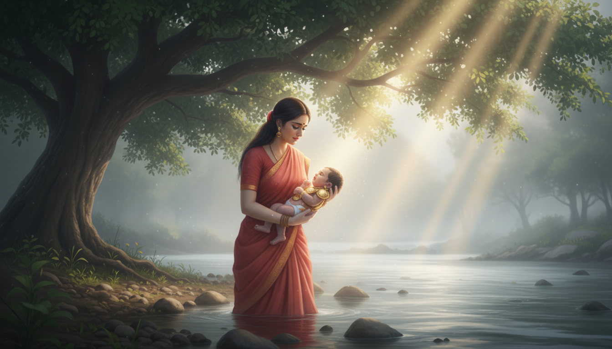
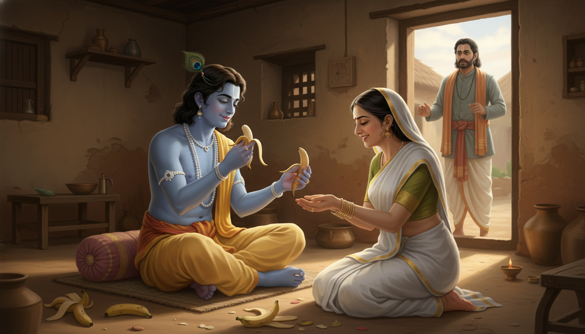
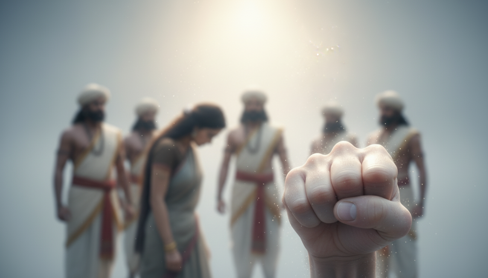
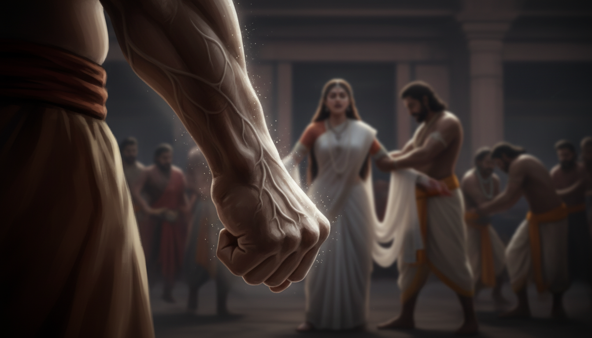
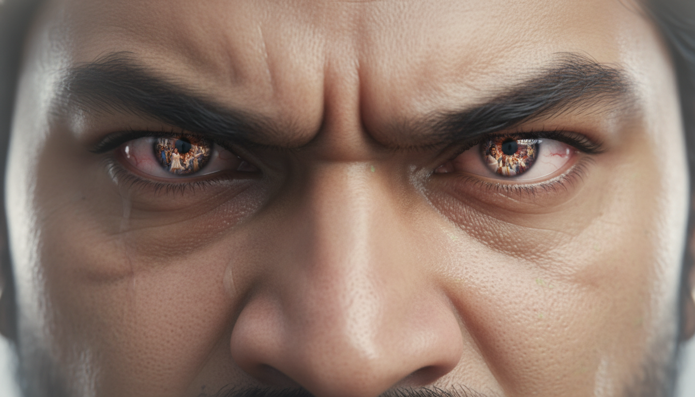
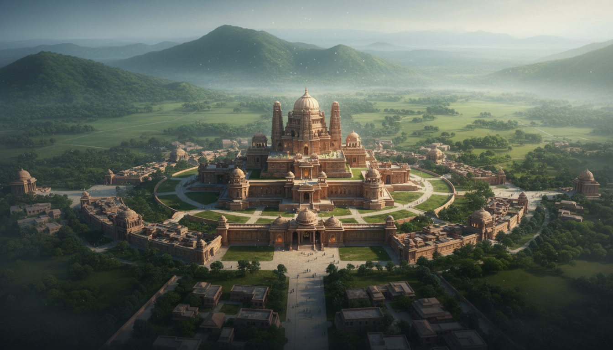
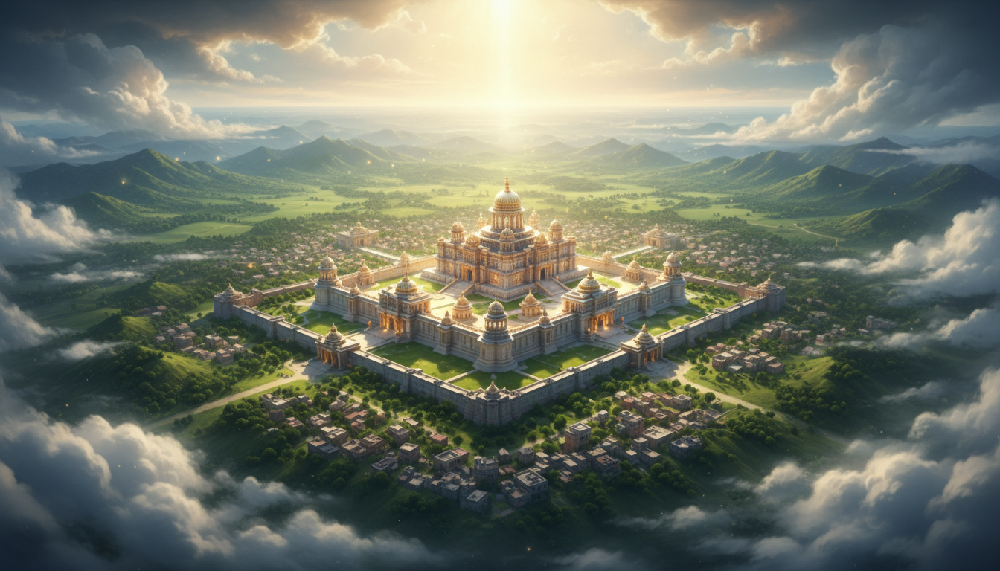
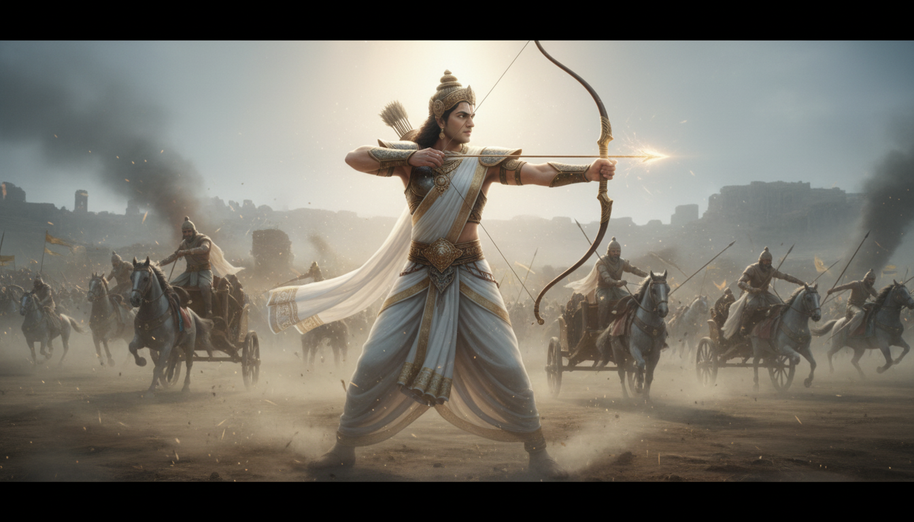

### Requirements
- Highest quality possible (based of character references)
- Situation based visual (No dialogue or lipsync should be present in the visual)
- Sync to story-based Song
- Focus or prioritise over Visual presentation (Images generated should directly convey the intent/emotion of scene & video generated should compliment that)
- Use wide variety of shot from Extreme close-up to extreme wide shots based of shot necesity (Find different types of shots in the Camera guide.)
- Nothing works in the first try, the images below took 5-10 tries to get one perfect one.
- When direct storytelling is boring present indirectly.
- We are not just matching visual to song, Even without the song, the story of Mahabaratha has to be sequentially conveyed.

### References
- [AI Capability reference](https://www.youtube.com/@ai_artform)
- [Color depth & lighting reference](https://www.youtube.com/watch?v=SqCwJFmAyPk)


### Example Visuals

#### Kunti Leaving Kharna in the river
```text
Mahabaratham, the time when kharna was born for kunthi by the blessing of sun god, 
by the river bed, kunti (standing) was holding a baby born with golden armour under a
tree when godrays landing on the baby from the gaps between the leaves. 
Kunti was just about to leave the baby into the river. 
Kunti bearing a sad expression wearing a faded red half-saree (Langa voni). 
kunti was still young 19 years old.
```
Without character styling            |  then applied character styling by using previous one as reference
:-------------------------:|:-------------------------:
  |  

#### Sulabha feeding krishna banana peels
```text
Lord Krishna, with a gentle and serene smile, is seated on a simple cushion on the floor of a humble, traditional Indian home. 
He is gracefully accepting a banana peel from an woman, Vidura's wife (Sulabha), who is kneeling before him in a state of profound, ecstatic devotion. 
Her face shows pure bliss and absorption. Several banana fruit without peel are already on the floor beside Krishna, and he is about to eat one peel, showing clear relish. 
The atmosphere is warm, softly lit, and filled with deep spiritual love and humility. 
The home is sparsely furnished but radiates peace. Vidura(a member of royal court) stands in the background, just entering, his expression a mix of shock and eventual understanding.  
krishna eating peels leaving the actual fruit.
```
Based of prompt            |  Asked to remove fruit and keep just the peel
:-------------------------:|:-------------------------:
  |  

#### Droupathi's humiliation in Kurava's Court

Initial prompt          |  Enhanced prompt
:-------------------------:|:-------------------------:
Extreme close up shot of a fist tightly folded showing the agression of the person, while a women being humilated is being visible in background. a scene from Mahabaratham|Extreme close-up shot of Bheema's powerful fist, facing down, clenched so tightly his knuckles are white and veins bulge, trembling with suppressed, volcanic rage. In the shallow-focus background, the blurred figure of Draupadi is visible, being publicly humiliated in the Kaurava court by trying to pull her saree. The lighting is dramatic and low-key, highlighting the tension in the fist. A dark, intense, and cinematic scene from the Mahabharata. low angle shot.
  |  

#### Bheema's reaction to droupathi's humuliation
```text
Extreme close-up shot of Bheema's fierce eyes when droupathi is being humiliated. 
in mahabaratham. tight shot of eyes. closeup, women being humilated visible in his eyes reflection,
```
Based of prompt            |  Asked for a single eye closeup
:-------------------------:|:-------------------------:
  |  

These shots can also be utlised to transition to next shots.


### More Attempts

Prompt            |  Image
:-------------------------:|:-------------------------:
 City of hastinapur from mahabaratham. extreme wide ariel shot. grand palace, vibrant, not water just full of land and green hill in backdrop, ancient mythical story. |  
City of hastinapur from mahabaratham. extreme wide ariel shot. grand palace, vibrant, not water just full of land and green hill in backdrop, ancient mythical story. dynamic angle, from clouds |  
battle of mahabaratham, cinematic, dynamic shot. |  
battle of mahabaratham, cinematic, dynamic shot, krishna, arjuna & karna on their chariots facing each other (Profile views) about to release their respective arrows. extreme wide shot amid war. very long gap between. |  